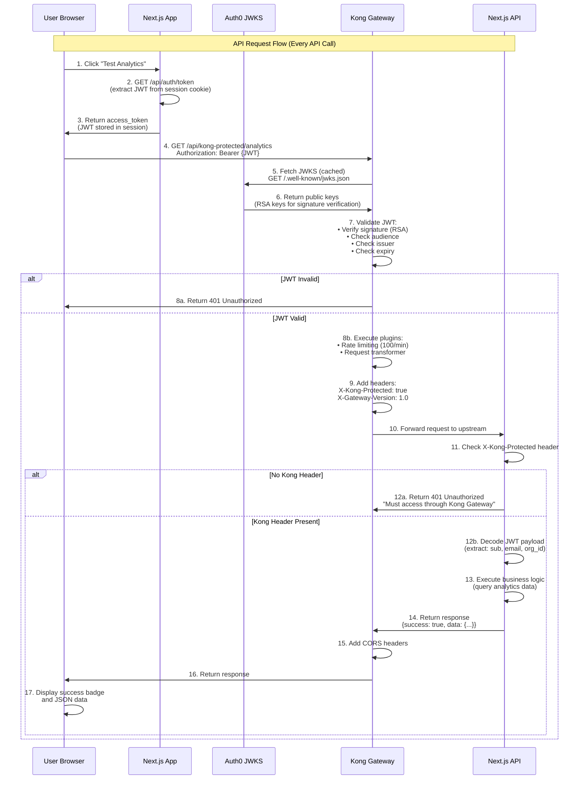

# Kong Gateway Request Flow

This diagram shows the complete flow for API requests through Kong Gateway with Auth0 JWT validation.

## Key Points

### Kong Request Flow (17 Steps)
- Happens **on every API request** through Kong
- Frontend retrieves existing JWT from session (no Auth0 authentication call)
- Kong validates JWT locally using cached Auth0 public keys
- Kong only calls Auth0 JWKS endpoint occasionally to refresh key cache
- JWT validation uses asymmetric cryptography (RSA signature verification)

### Security Layers
1. **Kong validates JWT** - Ensures token is genuine, not expired, correct audience/issuer
2. **Kong adds protected header** - `X-Kong-Protected: true`
3. **Next.js checks header** - Ensures request came through Kong (prevents direct bypass)
4. **Next.js decodes JWT** - Extracts user context from validated token

### Kong Plugins Executed (Step 8b)
- **OpenID Connect** - JWT validation against Auth0
- **Rate Limiting** - 100 requests/minute, 1000/hour
- **CORS** - Cross-origin request handling
- **Request Transformer** - Add X-Kong-Protected header
- **Pre-Function** - Handle OPTIONS preflight

### JWKS Caching
- Auth0 public keys are **cached by Kong** (typically 1+ hours)
- Not fetched on every request (performance optimization)
- Keys only refreshed when cache expires or key rotation occurs

### Why This Architecture Works
- **Performance**: JWT validation is local (no Auth0 call per request)
- **Security**: Two-layer protection (Kong JWT validation + Next.js header check)
- **Scalability**: Kong handles rate limiting, CORS, request transformation at gateway layer
- **Separation of Concerns**:
  - Auth0: Identity provider (issues tokens during login)
  - Kong: API Gateway (validates tokens, enforces policies)
  - Next.js: Business logic (processes authenticated requests)
